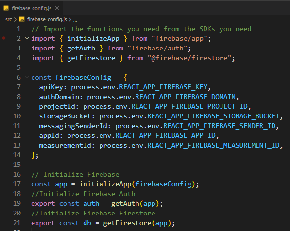
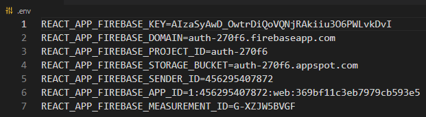

<!-- 
  IDEAS: Break down the course instructions into separate "md" files:
    1. Introduction/Project Overview and Setup/Installation
    2. Day 1 - Auth 
    3. Day 2 - Firestore
    4. Day 3 - Firestore Rules/Authorization
    5. Day 4 - ????
 -->
# Cars App - Project Instructions

## Overview

<!-- 
  TODO: Add an Overview 
  (What, Why, How? What will be the final outcome?) 
-->

## Setup

<!-- TODO: Fork and Clone Repo, npm install -->
1. Fork and Clone this repo.

2. In the main directory of this project, run `npm install` in your terminal.

3. Run `npm start` to see the React project on a live server.

### Firebase Configuration and .env

Let's first take a look at the "firebase-config" file in the main directory of the project. Notice that we are grabbing environment variables that should be coming from a ".env" file. You prepared a ".env" file in the pre-class assignment and you will be using that exact same file for this project, as it has the same credentials we will be using for this project. 

1. Copy the ".env" file from pre-class and paste it into the **main directory** of our new "Cars" project.

2. OR create a new ".env" file in the main directory and provide it the credentials from your Firebase console. 

>NOTE: The variable names in the ".env" file must match what you see inside the in the "firebase-config" file. If not, make sure that they are matching in order for this to work.

## Day 1 - Class 8 Authentication

[Part One Project Instructions ](./partOne.md)

## Day 2 - Class 9 CRUD 

[Part Two Project Instructions](./partTwo.md)

## Day 3 - Class 10 Authorization

[Part Three Project Instructions](./partThree.md)

## Day 4 - Class 11 Queries 

[Part Four Project Instructions](./partFour.md)
